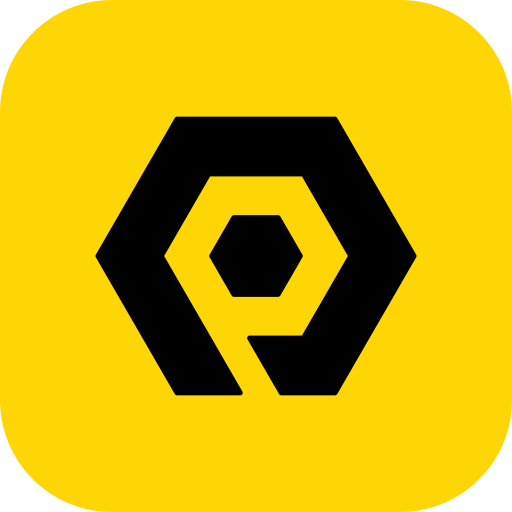

<div align="center">



# PractiCode Learn

**Learn the skills employers are hiring for, by actually doing them.**

Hands-on lessons in web development, data analysis, UI/UX design and AI, with an AI tutor built into every lesson.<br>
Mapped to globally recognised standards, and light enough for any phone and any network.

[](ROADMAP.md)
[](LICENSE)
[](LICENSING.md)
[](docs/design/ux-principles.md#accessibility)

[Vision](docs/product/vision.md) · [Curriculum](docs/curriculum/standards-framework.md) · [Teaching model](docs/curriculum/pedagogy.md) · [Design](docs/design/design-system.md) · [Architecture](docs/architecture/overview.md) · [Roadmap](ROADMAP.md)

</div>

---

## Why this exists

Most online learning still works like television: press play, watch someone else code, forget most of it by Friday. That model has three problems.

1. **Watching isn't learning.** In a study of a Coursera MOOC, interactive "doing" activities had about **six times** the learning impact of watching video or reading ([Koedinger et al., 2015](docs/research/sources.md#koedinger-2015)). Students in lecture-style classes are **1.5 times more likely to fail** than students in active-learning classes ([Freeman et al., 2014](docs/research/sources.md#freeman-2014)).
2. **Video is heavy.** Streaming uses about 1 GB per hour at standard definition and up to 3 GB in HD. A 40-hour video course is a real share of a monthly income in much of the world, and it stalls on a weak signal.
3. **Certificates rarely mean anything.** Few platforms show employers *what* a learner can do, measured against a standard the employer already recognises.

**PractiCode Learn** is our answer. It is built by the team behind [PractiCode Academy](https://practicode.tech), which teaches these same skills in person in Ibadan, Nigeria. Demand outgrew a classroom, so we are building the platform we wish our learners had.

## What makes it different

| | Typical platforms | PractiCode Learn |
|---|---|---|
| **Lesson format** | Video lectures with a quiz at the end | Interactive steps you predict, run, change and build ([PRIMM](docs/curriculum/pedagogy.md#the-lesson-loop-primm)) |
| **Data use** | ~1–3 GB per hour of video | Text, code and SVG animation, with a target of ≤150 KB per lesson ([lesson budget](docs/curriculum/lesson-format.md#performance-budget)) |
| **Offline** | Rare, app-only | Installable web app; download a module once, learn anywhere |
| **Practice** | Optional | Built in: daily spaced review ([FSRS](docs/curriculum/pedagogy.md#retrieval-and-spacing)) and mastery checks |
| **Help when stuck** | Forums and video comments | An AI tutor in every lesson that gives hints first and shows its source ([ADR 0006](docs/architecture/adr/0006-ai-tutor-and-site-assistant.md)) |
| **Credentials** | PDF certificate | Verifiable [Open Badges 3.0](docs/architecture/overview.md#credentials) mapped to SFIA 9 skills |
| **Curriculum** | Opaque | Syllabus published openly, with every outcome mapped to a [recognised framework](docs/curriculum/standards-framework.md) |

## Tracks

All four tracks launch together. Each one maps to a recognised standard so learners, employers and funders can check what was learned.

| Track | Core tools | Aligned to |
|---|---|---|
| [Front-End Web Development](docs/curriculum/tracks/front-end-web-development.md) | HTML, CSS, JavaScript, Git, GitHub, REST APIs, Netlify | [MDN Curriculum](https://developer.mozilla.org/en-US/curriculum/) · WCAG 2.2 · SFIA 9 (PROG, ACIN) |
| [Data Analysis](docs/curriculum/tracks/data-analysis.md) | Excel, Power Query, Power Pivot, Power BI, DAX | Microsoft PL-300 skills measured · SFIA 9 (BINT, VISL) |
| [UI/UX Product Design](docs/curriculum/tracks/ui-ux-product-design.md) | Figma, FigJam, Figma Community, Iconify | ISO 9241-210 · Double Diamond · WCAG 2.2 · SFIA 9 (URCH, HCEV, USEV) |
| [AI & Machine Learning](docs/curriculum/tracks/ai-machine-learning.md) | Python, Jupyter, pandas, scikit-learn, TensorFlow | ACM/IEEE-CS/AAAI CS2023 (AI) · SFIA 9 (DATS, MLNG) · UNESCO AI ethics |

## How a lesson works

Each lesson is a short sequence of screens, usually 5–12, that takes 10–15 minutes and follows a research-backed loop:

```
Predict  →  Run  →  Investigate  →  Modify  →  Make
  guess       see it     take it        change      build your
  the output  happen     apart          one thing   own version
```

Diagrams animate one step at a time at the learner's pace. Code runs in the browser. Every animation also has a static, screen-reader-friendly version for anyone who has turned on reduced motion. See [Teaching model](docs/curriculum/pedagogy.md) and [Lesson format](docs/curriculum/lesson-format.md).

## Business model

Freemium with regional pricing. See [Business model](docs/product/business-model.md).

- **Free**: Module 1 of every track, the daily review, the community and 5 AI tutor questions a day.
- **Pro**: every module, projects with automated feedback, verified certificates, offline downloads and 50 AI tutor questions a day. Priced in local currency, with need-based scholarships.
- **Mentor**: Pro plus a 3-month cohort with live classes and human reviews, delivered by PractiCode Academy online or in Ibadan.

## Project status

This repository is in the **design phase**. What exists today:

- [x] Product vision, personas and positioning
- [x] Competitive research (Coursera, Udemy, freeCodeCamp and seven others)
- [x] Curriculum standards framework and four track syllabi
- [x] Teaching model and lesson format specification
- [x] Design system and UX principles
- [x] Proposed architecture and decision records
- [x] Final visual direction chosen: **Prism** ([design system](docs/design/design-system.md))
- [x] UI designs for all 37 v1 screens in dark and light mode, at desktop and phone width, fully clickable, on one spacing standard ([design/](design/README.md))
- [ ] v1 specification sign-off ([draft](docs/specs/2026-10-02-v1-platform-design.md))
- [ ] Implementation plan
- [ ] Application code

## Repository structure

```
.
├── brand/                   Brand config (single source for name, colours, fonts) and logo files
├── design/                  UI designs and links to the design canvas
├── docs/
│   ├── product/             Vision, personas, business model, impact metrics
│   ├── research/            Competitive analysis, UI research tools, sources
│   ├── curriculum/          Standards framework, pedagogy, lesson format, track syllabi
│   ├── design/              Design system, UX principles, accessibility
│   ├── architecture/        Proposed architecture and decision records (ADRs)
│   ├── compliance/          Privacy and data protection
│   └── specs/               Specifications awaiting or past review
├── .github/                 Issue and pull request templates
├── ROADMAP.md
└── CHANGELOG.md
```

## Proposed stack

Next.js (App Router, TypeScript) · Tailwind CSS · Supabase (Postgres, Auth, Row Level Security) · MDX lesson content · in-browser code execution (sandboxed iframes; Pyodide for Python) · PWA with offline lesson packs · Open Badges 3.0 · xAPI learning records · Vercel.

The rationale and alternatives are in [Architecture](docs/architecture/overview.md) and the [ADRs](docs/architecture/adr/). The stack is a proposal until the v1 spec is approved.

## Contributing

We welcome curriculum feedback, accessibility reviews, translations and, once the app exists, code. Read [CONTRIBUTING.md](CONTRIBUTING.md) and the [Code of Conduct](CODE_OF_CONDUCT.md) first. To report a security issue, follow [SECURITY.md](SECURITY.md).

## Licensing

- **Code:** [GNU AGPL-3.0](LICENSE).
- **Published syllabi and standards mappings** (`docs/curriculum/`): [CC BY-SA 4.0](LICENSING.md).
- **Full lesson content, the PractiCode name and logos:** all rights reserved.

See [LICENSING.md](LICENSING.md) for the details.

## About

PractiCode Learn is a product of PractiCode, the team behind [PractiCode Academy](https://practicode.tech) in Old Bodija, Ibadan, Nigeria.<br>
Contact: [practicodeacademy@gmail.com](mailto:practicodeacademy@gmail.com)

<!-- Team: add the founder and technical lead names and roles here. -->
