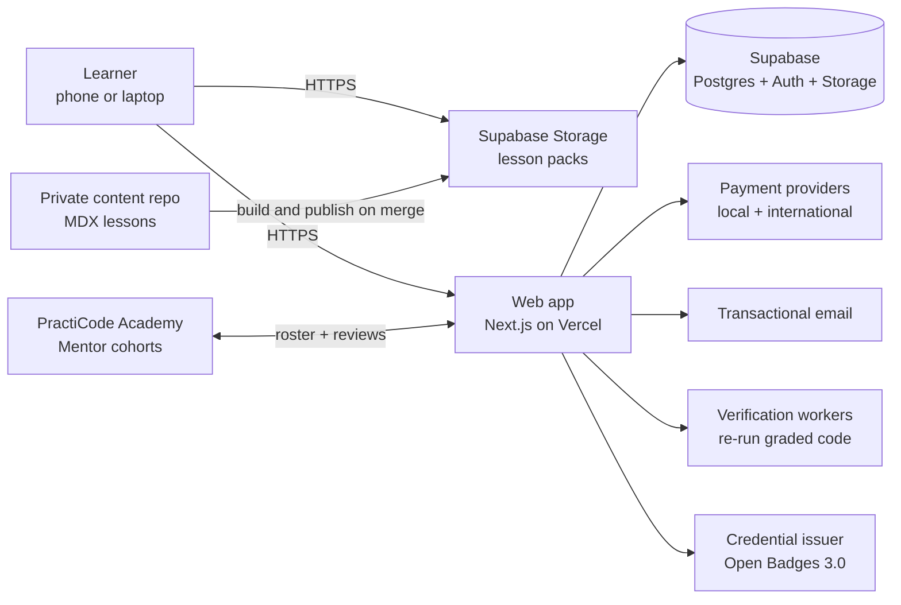
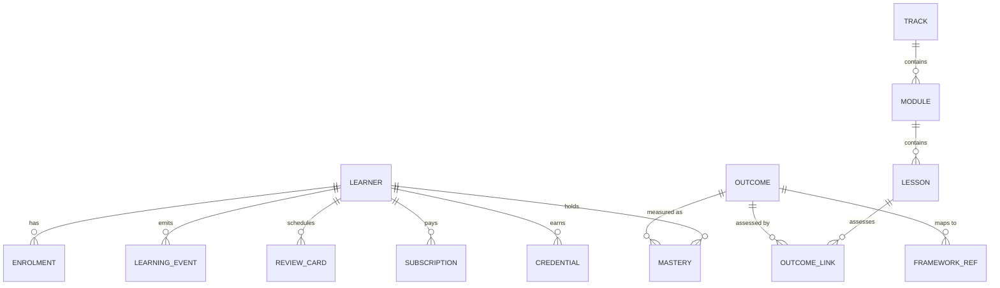

# Architecture overview

> **Status: Proposed.** This is the intended architecture, pending approval of the [v1 spec](../specs/2026-10-02-v1-platform-design.md). Each significant choice has an [ADR](adr/README.md).

## Drivers

The architecture serves five requirements, in priority order:

1. **Low data and offline-first.** Lessons ≤ 150 KB, installable, and fully usable offline.
2. **Near-zero marginal cost per learner.** This keeps the Free tier and scholarships sustainable.
3. **Accessible and fast on low-end devices.** WCAG 2.2 AA, with a JavaScript budget of 170 KB or less on lesson pages.
4. **Trustworthy credentials.** Assessments can't be faked by editing the client.
5. **Small-team velocity.** One language (TypeScript), managed services and boring technology.

## System context

## Components

### Web app
- **Next.js (App Router) + TypeScript + React Server Components.** Server-rendered pages for speed and search ranking; client components only where interaction needs them.
- **Tailwind CSS** with design tokens generated from [brand.config.json](../../brand/brand.config.json).
- **PWA:** a service worker (Serwist) precaches the app shell, and runtime-caches lesson packs the learner downloads.
- **i18n:** message catalogues from day one (English first), with right-to-left support.

### Content pipeline
See [ADR 0007](adr/0007-lessons-in-a-private-repo-as-lesson-packs.md).
- Lessons are authored in **MDX** in a *private* content repository (see [ADR 0004](adr/0004-open-syllabus-proprietary-lessons.md)).
- On every merge, a build compiles each lesson into a **versioned lesson pack** (JSON), validates it against the [lesson format](../curriculum/lesson-format.md), checks the 150 KB budget, and runs every coding task's solution and starter in a real browser.
- Packs go to Supabase Storage: free packs to a public bucket, Pro packs to a private bucket behind short-lived signed links. The catalogue goes to Postgres. The app never bundles lessons, so a fix reaches learners without a redeploy.
- Tests for certificate-bearing assessments are kept in a server-only bucket and **never shipped to the client**.

### Code execution
| Language | Where it runs | How |
|---|---|---|
| HTML, CSS and JS | Learner's browser | A sandboxed `<iframe srcdoc>` with `sandbox="allow-scripts"` and no same-origin access. Tests run in a Web Worker against the iframe's DOM through `postMessage`. |
| Python (AI & ML) | Learner's browser | **Pyodide** (WebAssembly) in a Web Worker; packages cached for offline use |
| DAX and spreadsheet concepts | Learner's browser | Purpose-built simulators for the concepts; real Power BI work happens in Power BI Desktop |
| Graded certificate work | Server | Submissions re-run in an isolated sandbox (for example, Vercel Sandbox) against hidden tests before a credential is issued |

Practice runs cost nothing. Only certificate-bearing submissions use server compute.

### Data and auth
- **Supabase Postgres** with **Row Level Security** on every table. A learner can only ever read their own progress.
- **Supabase Auth:** email magic links, passkeys, and Google sign-in. Phone OTP to be evaluated for markets where email is less common.
- **Learning records** are stored as **xAPI statements** (actor, verb, object, result) in an append-only table, so they can be exported to any learning record store and analysed later.
- **Offline sync:** progress events are queued in IndexedDB and replayed idempotently (each event has a client-generated UUID). Merging is conflict-free because events are append-only.

### Core data model (initial)

Track, module, lesson and outcome definitions come from the content pipeline and are read-only in the app. Learner tables are the only mutable state.

### Payments
Learners pay in local currency through local methods: cards, bank transfer, USSD and mobile money in Africa, and cards internationally. Payment providers will be chosen in the implementation plan, with candidates evaluated on coverage, fees, subscription support and payouts. We never store card data, so PCI scope stays with the provider. Webhooks are verified and processed idempotently.

### AI tutor and site assistant
A server-side `tutor` unit answers learner questions in lessons and projects, and visitor questions on the public site ([ADR 0006](adr/0006-ai-tutor-and-site-assistant.md)).

- **Grounding:** each request carries the current lesson step, matching passages from the lesson pack and the learner's code. The site assistant uses a curated knowledge base only.
- **Policy:** hints before answers, a source shown under every answer, and switched off during module checks and certificate projects.
- **Quotas:** enforced server-side, with 5 questions a day on Free and 50 on Pro (a proposal), plus rate limiting.
- **Provider:** behind one interface. By default it uses a small, fast model with prompt caching, and is evaluated in CI against a per-track answer set before any prompt or model change.
- **Data:** learner input is never used for model training. Logs are kept for 30 days, then deleted.

### Credentials
- Certificates are issued as **Open Badges 3.0** credentials (W3C Verifiable Credentials), cryptographically signed, with the outcomes and SFIA references embedded as alignments.
- Each badge has a public verification page and an "Add to LinkedIn" action.
- Signing keys are held in a managed key service, never in application code.

### Observability and quality
- Errors: Sentry. Performance: real-user monitoring of Core Web Vitals by country and connection type.
- Product analytics: consent-based, privacy-preserving and EU-hosted.
- CI: type-check, lint, unit tests (Vitest), end-to-end tests (Playwright, including a throttled low-end-phone profile), axe accessibility checks, Lighthouse budgets, and lesson-pack size checks.

## Security baseline

- OWASP ASVS Level 2 as the target. A Content Security Policy that restricts learner-code iframes to an isolated origin.
- Secrets live only in environment variables and are never committed.
- Least-privilege service roles. The Supabase service key is used only in server code.
- Dependencies are monitored (Dependabot), and production deploys need a passing CI run.

## Alternatives considered

| Decision | Chosen | Alternatives | Why |
|---|---|---|---|
| Framework | Next.js | Remix and React Router v7, SvelteKit, Astro | Largest hiring pool; RSC for low client JavaScript; the team already uses it in `practicode` and `practicode-internal` |
| Backend | Supabase | Firebase, a custom Node API with Postgres | Postgres plus RLS plus Auth in one; the team already uses it; open source, so it can be self-hosted if needed |
| Code execution | In the browser | Server containers (as many platforms use) | Zero marginal cost, works offline, no abuse surface for practice runs |
| Video | None | Hosted video | See [ADR 0002](adr/0002-interactive-lessons-without-video.md) |
| Content format | MDX in git | Headless CMS | Version control, reviewable diffs, no CMS cost; can add a CMS editor later |
